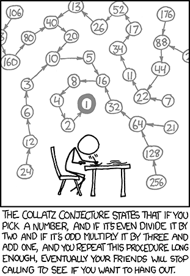
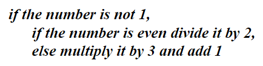
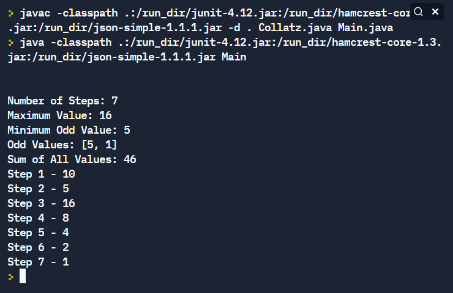

# Collatz Conjecture 


<br></br>
The Collatz conjecture states that for any positive integer repeatedly applying the following procedure will always eventually reach the integer value 1. 



The conjecture has been checked by computer for all starting values up to 260. However, this computer evidence is not a proof that the conjecture is true (sometimes a conjecture's only counterexamples are found when using very large numbers).

Write a class called Collatz with a single private instance variable called startNum that stores the starting number of a collatz sequence. Provide both a default constructor and an initialization constructor. For only this single piece of data, give your object the ability to generate all kinds of "collatzy" information as well as print out information about itself by doing the following:

- Add a method called **steps()** that returns the number of steps of the above algorithm that are required for the starting number to reach 1.
- Add a method called **sequence()** that returns an array of the sequence of numbers from the starting number to 1.
- Add a method called **maxValue()** that returns the maximum value in the sequence.
- A method called **minOddValue()** that returns the minimum value of all the odd numbers in the sequence. If there are odd values other than 1 return the minimum of those, otherwise return 1.
- Add a method called **oddValues()** that returns an array of all the odd numbers in the sequence.
- Add a method called **sumValues()** that returns the sum of all the values in the sequence.
- Add a **toString()** method that returns the step # and the corresponding value at the step.


Write another class to test your Collatz class. Ask the user for the starting number and create a Collatz object (i.e. an instance of the Collatz class) with this starting number. Print this object. Finally, test out this Collatz object's methods. A possible example run is shown on the right.


## Extra Challenges

In your oddValues() method that returns an array of all the odd numbers in the sequence 
see if you can write the method with only a single if statement
see if you can do without a statement that assigns a variable to its value plus 1 on a line by itself (e.g. i+=1; or i = i + 1; or i++;)

Investigate  JAVA printf() to print the output aligned in columns as shown below
```
step 1     27
step 2     82
step 3     41
step 4    124
   ⋮  ⋮      ⋮
step 70  1822
step 71   911
step 72  2734
   ⋮  ⋮      ⋮
step 99    35
step 100  106
step 101   53
   ⋮  ⋮      ⋮
step 107    5
step 108   16
step 109    8
step 110    4
step 111    2
step 112    1
```
  

  
  
